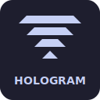

  

# Hologram for VS Code

Syntax highlighting and Go to Definition support for the [Hologram](https://github.com/nickvdyck/hologram) framework.

## Install

- **VS Code**: [Install from Marketplace](https://marketplace.visualstudio.com/items?itemName=MDIS.vscode-hologram)
- **Open VSX** (VSCodium, Gitpod, etc.): [Install from Open VSX](https://open-vsx.org/extension/MDIS/vscode-hologram)

## Features

### Syntax Highlighting

Full syntax highlighting for `.holo` template files including:

- HTML tags and attributes
- Hologram control flow: `{%if}`, `{%else if}`, `{%else}`, `{%for}`, `{/if}`, `{/for}`
- Raw blocks: `{%raw}...{/raw}`
- Elixir expressions: `{expression}`
- Component tags: `<Module.Component>`
- Event bindings: `$click`, `$change`, etc.
- `<slot>` tags
- Embedded CSS in `<style>` blocks
- Embedded JavaScript in `<script>` blocks

#### `~HOLO` Sigil Support

Hologram templates embedded in Elixir files via `~HOLO` sigils are automatically highlighted with full template syntax support.

### Go to Definition

Cmd+click (or Ctrl+click) navigation works in both `.holo` and `.ex` files:

| Context | Jumps to |
|---|---|
| `@variable` | The `put_state(...)` call or `prop :name` declaration |
| `$click="action"` | The matching `def action(...)` or `def command(...)` |
| `<Component>` | The component module (configurable target) |
| `to={PageModule}` | The page module's template |
| `function_call()` | The `def`/`defp` definition in the current module |

Component resolution supports aliases including `alias Mod.{A, B}` grouped syntax.

### Configuration

| Setting | Default | Description |
|---|---|---|
| `hologram.defaultJumpTarget` | `template` | Where Cmd+click lands on component tags: `template`, `init`, or `module` |

## License

MIT
