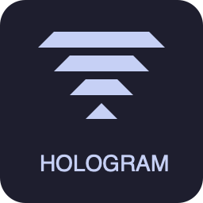

<p align="center">
  
</p>

# Holo Dev for VS Code

[](https://marketplace.visualstudio.com/items?itemName=MDIS.holo-code)
[](https://marketplace.visualstudio.com/items?itemName=MDIS.holo-code)
[](LICENSE)

Syntax highlighting, intelligent autocomplete, diagnostics, and Go to Definition for the [Hologram](https://hologram.page/) framework.

## Install

### VS Code

Search for **"Holo Dev"** in the Extensions panel, or [install from Marketplace](https://marketplace.visualstudio.com/items?itemName=MDIS.holo-code).

### Cursor / Open VSX

Search for **"Holo Dev"** in Cursor's Extensions panel, or [install from Open VSX](https://open-vsx.org/extension/MDIS/holo-code).

### Manual Install (VSIX)

If the extension isn't showing in your editor's marketplace yet:

1. Download the latest `.vsix` file from [GitHub Releases](https://github.com/Neophen/mdis_holo_code/releases/latest)
2. Open Command Palette (`Cmd+Shift+P` / `Ctrl+Shift+P`)
3. Run **"Extensions: Install from VSIX..."**
4. Select the downloaded `.vsix` file

## Setup

All features work out of the box — the extension scans your `.ex` files to find pages, components, props, actions, commands, and Ash resource fields. No configuration required.

For the **most accurate results** (especially in projects with custom `use` wrappers or complex Ash resources), set up the optional Mix introspection task:

### Mix Introspection (Optional, Recommended)

The [`mdis_holo_dev`](https://github.com/Neophen/mdis_holo_dev) Elixir dependency provides a Mix task that introspects your compiled modules — giving the extension accurate data about pages, components, props, actions, commands, and Ash resource fields.

1. Add `{:mdis_holo_dev, "~> 0.1", only: :dev}` to your `mix.exs` deps
2. Run `mix deps.get`
3. Run the introspection task:

```bash
# One-shot — generates .holo_dev/*.json
mix holo_dev.introspect

# Watch mode — re-generates on recompile (run alongside phx.server)
mix holo_dev.introspect --watch
```

The extension watches `.holo_dev/*.json` and automatically picks up changes — no restart needed.

> `.holo_dev/` is automatically added to your `.gitignore`.

## Features

### Syntax Highlighting

Full syntax highlighting for `.holo` template files and `~HOLO"""` sigils in Elixir files:

- HTML tags and attributes
- Hologram control flow: `{%if}`, `{%else if}`, `{%else}`, `{%for}`, `{/if}`, `{/for}`
- Raw blocks: `{%raw}...{/raw}`
- Elixir expressions: `{expression}`
- Component tags: `<MyComponent>`
- Event bindings: `$click`, `$change`, `$submit`, etc.
- Expression attributes: `count={@count}`
- `<slot>` tags
- Embedded CSS in `<style>` and JavaScript in `<script>` blocks

### Autocomplete

#### Event Types

Type `$` inside an HTML tag to see all Hologram event types (`$click`, `$change`, `$submit`, etc.) sorted by usage frequency. The list is fully configurable.

#### Actions & Commands

After selecting an event type and typing `=`, the extension scans the current module and offers:

- **Actions** without params — inserts text syntax: `"my_action"`
- **Actions** with params — inserts expression shorthand: `{:my_action, key: value}`
- **Actions (longhand)** — inserts full syntax with target/params placeholders
- **Commands** — inserts longhand syntax: `{command: :my_command}`

#### State & Props

Type `@` inside a `~HOLO` template to see all available state variables and props from the current module.

#### Field Access

Type `@place.` when `place` is a prop with a known Ash resource type — the extension suggests its attributes (`id`, `title`, `slug`, etc.).

#### Page Completions

Type `to={` inside a `<Link>` component or use `put_page(component, ` in an action to see all available page modules with their routes.

### Diagnostics

- **Unknown fields** — `@place.nonexistent` warns with "Did you mean?" suggestions and quick fixes
- **Invalid pages** — `to={NonExistentPage}` warns with similar page suggestions
- **Missing required props** — warns when a required prop is not provided on a component
- **Unknown props** — warns when an attribute doesn't match any declared prop

All diagnostics include quick fix actions (Cmd+.).

### Go to Definition

Cmd+click (or Ctrl+click) navigation:

| Context | Jumps to |
| --- | --- |
| `@variable` | `put_state(...)` or `prop :name` declaration |
| `$click="action"` | `def action(...)` or `def command(...)` |
| `<Component>` | Component module (configurable target) |
| `to={PageModule}` | Page module's template |
| `@place.title` | `attribute :title` in the Ash resource |
| `function_call()` | `def`/`defp` definition in the module |
| `layout ModuleName` | Layout module |

## Configuration

| Setting | Default | Description |
| --- | --- | --- |
| `holoDev.defaultJumpTarget` | `template` | Where Cmd+click lands on component tags: `template`, `init`, or `module` |
| `holoDev.eventTypes` | All 15 event types | Configurable event type list for autocomplete. Order = sort priority. |
| `holoDev.customComponents` | `[]` | Define additional components from deps with their props for validation. |

### Custom Components Example

```json
"holoDev.customComponents": [
  {
    "module": "MyLib.Components.Button",
    "props": [
      { "name": "label", "type": "string", "required": true },
      { "name": "variant", "type": "string" }
    ]
  }
]
```

## License

MIT
